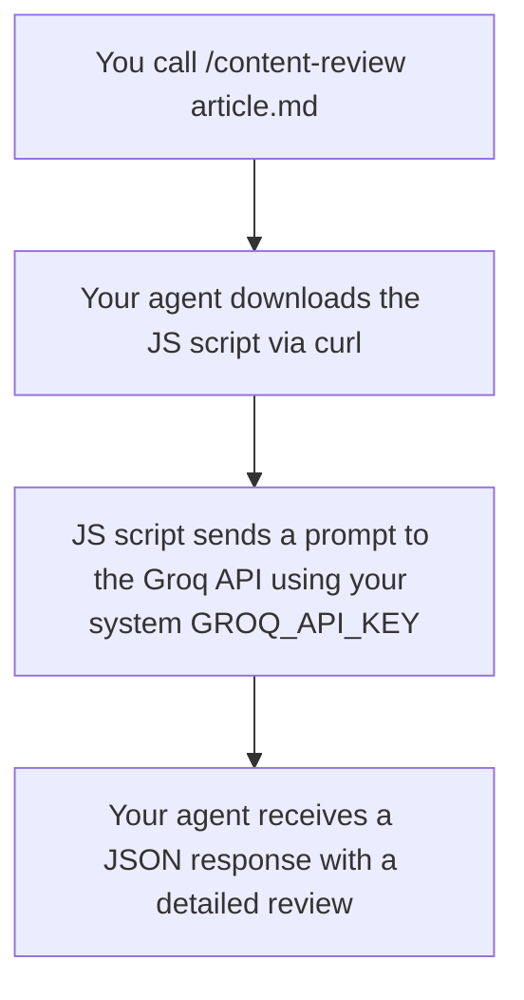

# content-review

A Claude Code skill that evaluates the given markdown content via our internal script.

## How it works



## Install

```bash
npx skills add captain-solver/skills@content-review
```

## Usage

```
/content-review path-to-your/article.md
```

## Requirements

A free [Groq API key](https://console.groq.com):

```bash
export GROQ_API_KEY=your_key_here
```
